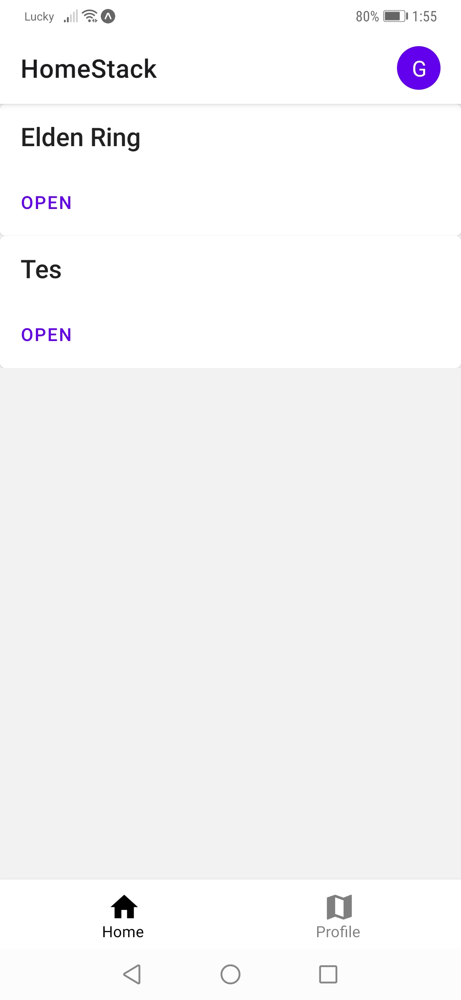
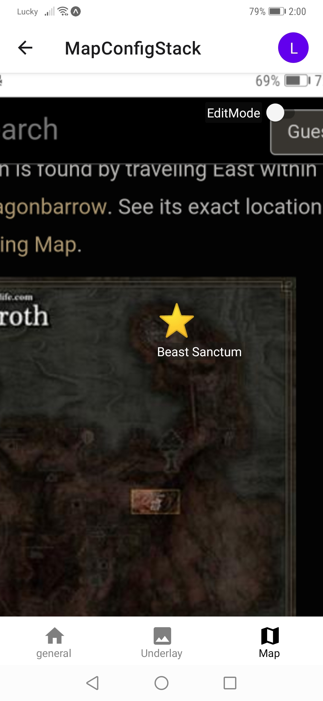
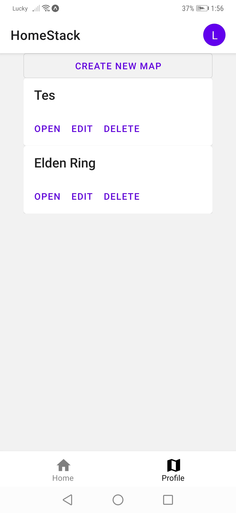
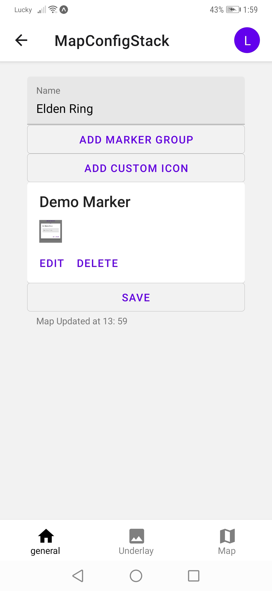

# EasyGameMap
This project implements a react native app that simplifies creating interactive game maps. 
Users can use the app to view, create or modify interactive maps. 

This repository is the front end of the app.

The backend can be found at [https://github.com/Leo927/EGMServer](https://github.com/Leo927/EGMServer).

## Preview




## Supported Platforms:

|Platforms| Planned| Tested |
----------|-----------|--|
|Web|✔|❌|
|Android|✔|✔|
|IOS|✔|❌| 

## Download Published Builds
* Web: TBD
* Android: [https://expo.dev/@leo347/EasyGameMap?serviceType=classic&distribution=expo-go](https://expo.dev/@leo347/EasyGameMap?serviceType=classic&distribution=expo-go)
* IOS: [https://expo.dev/@leo347/EasyGameMap?serviceType=classic&distribution=expo-go](https://expo.dev/@leo347/EasyGameMap?serviceType=classic&distribution=expo-go)

## Building
1. Install [NodeJS](https://nodejs.org/en/download/).
2. Install expo cli. See more [here](https://docs.expo.dev/workflow/expo-cli/)
   
        npm install --global expo-cli

3. Clone the repository 

        git clone https://github.com/Leo927/EasyGameMap.git

4. Change directory
  
        cd EasyGameMap
1. Install depdencies. 
   
        npm install .
2. Build for targeted platform. See more [detail](https://docs.expo.dev/workflow/expo-cli/).
  
        expo build:<platform>

## Browse Maps

Publically available maps are shown in the home screen. To see more detail of a map, click the OPEN button on the map card.  

 

## Viewing Maps


## Login
To login, the user can press the purple circle on the top right corner. 

 

A dialog will show up. Press the LOGIN button on the dialog. The user will be guided to login to Github and authorize the app. 
Follow Github's instruction and login. Once authorized, the user is logged in. 


Currently the only supported login method is Github Authentication. 

## Logout
To log out of ones account, press the purple circle on the top right and select LOGOUT. Note this button is only avaialble when the user is already logged in.


## Map Managment
To manage all maps owned by the user, the user must be logged in. 

Once logged in, there are two tabs at the bottom of the screen: Home and Profile. Press profile to see all the maps owned by the currently logged in user.

After a short loading, all the maps owned by the current user should be listed in the center of the screen. 



### Creating A Map
To create a map. The user must first login to their account. 

In the profile page, press CREATE NEW MAP button. 

The user must first give the map a name. And then press the SAVE button to create the map. 

If creating was successful, a small print will show up underneath the SAVE button.



### Changing Name
Thje name of a map can be changed in the general tab of the map. Once the name is changed, press SAVE button in the general tab. 

### Manage Custom Icons


#### Create A Custom Icon
Custom icons can be managed in MapConfigMarker component. To add a custom icon, go to general tab of the map management. 
And then Click ```ADD CUSTOM ICON```. An dialog will show up prompting user to enter the name and select an image for the icon.
Once the name and the image are selected. Press ```CONFIRM``` on the bottom right of the dialog to confirm.

#### Editing A Custom Icon
Once a custom icon is created. The user can see the icon in general tab. Pressing the ```EDIT``` Button on an icon card will 
display the edit dialog for the icon. 


#### Deleting A Custom Icon
To delete a custom icon, press the DELETE button on the icon card. Note that all markers on the map currently using this icon will switch to using built-in default icon.

### Manage Map Image
Map image can be selected in the Underlay tab of map config. 


Once an image is selected, the image will be displayed. The size of the image can also be defined. This is used to stretch some maps to their in-game sizes. 


### Manage Markers
Markers can be managed in the Map tab of the config page. 


To enable editing, toggle EditMode on the top right corner. 

#### Create Markers
In edit mode, the user can press the New Marker Button to create a new marker. The new marker is placed at the center of the screen by default. 


Then a marker detail dialog will show up for configuring the newly created marker. 


Once the fields are filled, user can press confirm or tab outside of the dialog to dismiss the dialog. 

#### Edit Markers
To edit a marker, the user must be in edit mode. First press the marker. The same dialog will show up. User can then edit the marker and press Confirm to exit the dialog. 

#### Delete Markers
To delete a marker, the user must be in edit mode. Press the target marker to open the marker detail dialog. Then press the DELETE button on the bottom right of the dialog. 

### Caveats
To save the changes made to a map, the user must pressed the SAVE button in the general tab. Otherwise no changes will be saved to the server. 

## Data Classes
### Map
Map has the following properties.

```javascript
_id: unique map id assigned by database,
name: name of the map. Cannot be empty. 
image: picture asset of the map. stored as a string
uid: uid of the user owning the map. Cannot be empty. 
width: Number representing the width of the map. Can be empty. Must be a number.
height: Number representing the height of the map. Can be empty. Must be a number.
markerGroups: set[str] representing the names of each markerGroups. each name must be unique. Can be empty. 
customIcons: dictionary[str, picture asset] representing a custom icon. 
markers: list of markers. format: list[marker]. May be empty or undefined. 
```

### Marker:
```javascript
id: uid of the marker,
title: String. Title of marker. Shown in the popup modal as title.
description: String. Detailed description of the marker.
label: String shown underneath the icon.
isCustomIcon: Bool. If true, the icon used will be from the customIcons. Other wise, the icon id points to a default icon. 
iconId: String representing the id of the icon. See isCustomIcon for more detail of where it comes from. 
left: number representing the distance of the center of icon from the left edge of the map. 
top: number representing the distance of the center of the icon from the top of the map. 
markerGroup: A list of strings pointing to several markerGroups from the map. 
```

### Icon:
```javascript
_id: string. Unique identifier to the icon.
name: string. Name of the icon. Must be unique within the same map;
image: string representation of the image. Supported format is gif, png, and jpg;
```

## MapView
The original propsal was to use react-native-webview-leaflet. After further research, we realized it may not be the best option. First of all, the package is out of maintenance and is not compatable with the current version of expo sdk (44.0). Secondly, it is a webview component which is inconvinient to use. We eventually decided to use pure react native plus react-native-paper to achieve the same effect. react-native-paper is mainly used for its design and dialog component. 

### Props:

* map: the map data conforming to the class [Map](../../classes/README.md/#map).

* setMap: the setter function to modifer map

### States/Refs:

* mapPos: ```Animated.ValueXY```. Controls the map offset from the top left corner of the parent to the top left corner of the map.

* mapZoom: ```Animated.Value```. Controls the zoom level of the map.

* isEditMode: ```Boolean```. Control whether the map is in edit mode.

### The underlaying image.
The image is a animated object. 

#### Position Offset
The position offset is controlled by ```mapPos```. It refers to the offset from the topleft corner of the map container to the top left corner of the map.

In view mode, the position is changed when the user is panning the map. 

In edit mode, the user must move the map by dragging on the map image itself instead of any marker. Start dragging from any marker will only move the marker. 

#### Zooming
The zoom level is controlled by ```mapZoom```. 

When the player zoom, the center of zooming is the center of the viewport. 

The relative position of center of viewport on the image can be calculated as: {x: (screenWidth/2 - mapPos.x)/zoom, y: (screenHeight/ 2 - mapPos.y)/zoom}. Note it is the value before zooming is applied.

When zoom level change from zoom_0 to zoom_1, the center of the image must remain the same. Therefore we have:
{x: (screenWidth/2 - mapPos.x_0)/zoom_0, y: (screenHeight/ 2 - mapPos.y_0)/zoom_0} = {x: (screenWidth/2 - mapPos.x_1)/zoom_1, y: (screenHeight/ 2 - mapPos.y_1)/zoom_1}

And if we solve the equation we have:
(screenWidth/2 - mapPos.x_0)/zoom_0 = (screenWidth/2 - mapPos.x_1)/zoom_1
mapPos.x_1 = screenWidth/2 * (zoom_1 - zoom_0) / zoom_1 + mapPos.x_0 * zoom_0/zoom_1

And the equation is similar for y.

### Markers showing on top of the image
Markers show locations of interest. They are stored in ```map.markers```.

There are two ways to interact with them. 

In edit mode, the user can drag a marker without dragging the map. This allows the user to change the position of a marker.

In either edit mode or view mode, the user can click/touch on a marker to show a detail dialog. The dialog hides some editing option while not in edit mode. See [more](../marker-detail/README.md) for more information on marker dialog.

The relative position of each marker should be provided as ```Marker.top``` and ```Marker.left```. This is the unzoomed offset from the top left corner of the map. 

The absolute position of each marker can be calculated as:
mapPos + [Marker.left, Marker.top] * zoom

The size of markers are not affected by ```mapZoom```.

### Edit Mode Toggle
On the top right corner of the viewport. There is a toggle that is only visible when the owner of the map matches the logged in user's id. Toggling it will toggle [isEditMode](#statesrefs)

### Context Button and Dialog
The context button hovers on the top left corner of the viewport. It doesn't move or scale with the rest of the map. When clicked, it shows a diaglog box displaying some context information and some interactions. See more from [here](../map-context/README.md)

### Search Button and Dialog
The search button is similar to a context button. Upon clicking, it shows a dialog box with an text input box and a search button. Making a search returns an array of markers matching the search criteria under the text input. Upon clicking on any of the result, the dialog will close and the map will auto center on the marker clicked. See more from [here](../map-search/README.md)

### Marker Group Button and Diaglog
This button is also similar to context button. Upon clicking, it shows a list of marker groups with toggles next to them. Toggling a marker groups will hide or show the markers belonging to the marker group. 

### Toolbox
This is a list of buttons that contains functionality for editing a map. Currently the only relavant functionality is ```New Marker```. It inserts a new marker in the center of the viewport.

## Todos
* Refactor MapConfigMarker. Extract the icon card and marker card into their own components.  
* Make custom icon list update immediately
* Add more login methods. 
* Searching map by name, user name.
* Searching markers in a map
* Marker Group Toggling
* Map Context Menu
* Dragging markers on a map to change marker coordinate.
* Zooming in/out of map
* Add a search bar in the home screen to search for maps. 


